# TP : travail collaboratif avec Git et GitHub

## Objectifs du TP

1. Travailler à plusieurs sur le même dépôt.
2. Créer et résoudre des conflits.
3. Se familiariser avec l'utilisation de l'interface en ligne GitHub.
4. Se familiariser avec le jargon technique.
5. Se familiariser avec le format *Markdown* (extension .md), utilisé pour la documentation sur des projets git.

## Ressources

- [Guide syntaxe Markdown, à utiliser pour faire la mise en page de vos fichiers markdown](https://docs.framasoft.org/fr/grav/markdown.html)

## Définitions

- ***Owner*** : propriétaire du dépôt.
- ***Developers*** : collaborateurs qui travaillent sur le dépôt.
- ***Issue*** : problème à résoudre, généralement on crée une *issue* lorsqu'on souhaite affecter un développeur sur une tâche, ça peut être un bug, une nouvelle fonctionnalité, de la documentation etc... Généralement l'*issue* débouche sur la création d'une nouvelle branche portant le même nom.
- ***Pull/Merge request*** : il s'agit d'une demande de soumission de votre code (vos modifications sur un projet) au propriétaire du dépôt pour que ce dernier puisse l'intègre sur la branche principale *main*.
Lorsque le propriétaire accepte votre travail, vos modifications seront *mergées*(intégrées) dans la branche *main*.
Lorsqu'il refuse, il vous donnera la raison du refus.
Chaque propriétaire impose ses propres exigences (fichier *`README.md`*) en matière d'installation, technologies, versions, nommage des commits, qualité du code requise, tests unitaires, intégrations, d'acceptation, fonctionnelles etc.
- ***`README.md`*** : à la racine du projet, fichier contenant les instructions pour installer le projet plus généralement la documentation du projet.
Également présent dans les sous-dossiers du projet pour donner des instructions plus spécifiques à cette partie du projet.
- ***.gitignore*** : à la racine du projet, fichier permettant d'ignorer certains fichiers ou dossiers qu'on ne souhaite versionner ou envoyer sur le dépôt distant.
- ***Assigner*** : désigner un collaborateur pour effectuer une tâche.
- ***Reviewer*** : un collaborateur qui va effectuer de la revue de code (revoir, vérifier, corriger votre code) d'un autre collaborateur.

## Formation des groupes

- Groupe de 3 développeurs.
- Dans chaque groupe :
  - 1 *Owner*;
  - 2 *Developers*.

## Tâches du *owner* au lancement du projet

1. Depuis Github, Créez un dépôt vide (aucun fichier) GitHub nommé ***tp-git*** .
2. En local :

   2.1 Faites le lien avec le dépôt distant;

   2.2 Créez les fichiers `README.md` et `.gitignore`;

   2.3 Effectuez votre **premier commit**;

   2.4 Renommez la branche *master* en *main*;

   2.5 *Pushez*.
3. Depuis Github, invitez les 2 autres collaborateurs à participer au projet.

   - **Settings  > Access > Collaborators > add people**.
   - Saisissez leurs adresses e-mails.

##### Ilustration ajout des collaborateurs

4. Depuis GitHub, Créez deux *issues* : 

   1. Première *issue* nommée ***feature/morning_menu*** et assignez-le au premier développeur (développeur 1).
   
   2. Deuxième *issue* nommée ***feature/lunch_menu*** et assignez-le au second développeur (développeur 2).

##### Illustration création d'un *issue*
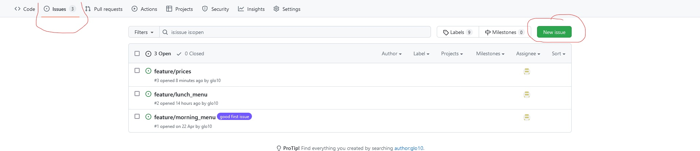
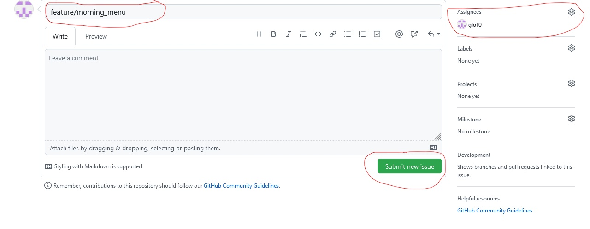

## Tâches du *owner* après le lancement du projet

5. Depuis GitHub, acceptez ou rejetez les demandes  *pull requests* des développeurs.
   - En cas de rejet, indiquez au(x) développeur(s) le(s) motif(s) en utilisant le champ de commentaire proposé par GitHub;
6. En local, uniquement en cas d'acceptation des modifications :
- Récupérez toutes modifications (branches) ;
- *Mergez* la branche du développeur qui a soumis la demande de pull request ;
- Resolvez les éventuels conflits ;
- *Pushez* sur la branche *main*.
##### Illustration du traitement de la demande de pull-request (merge pull request)

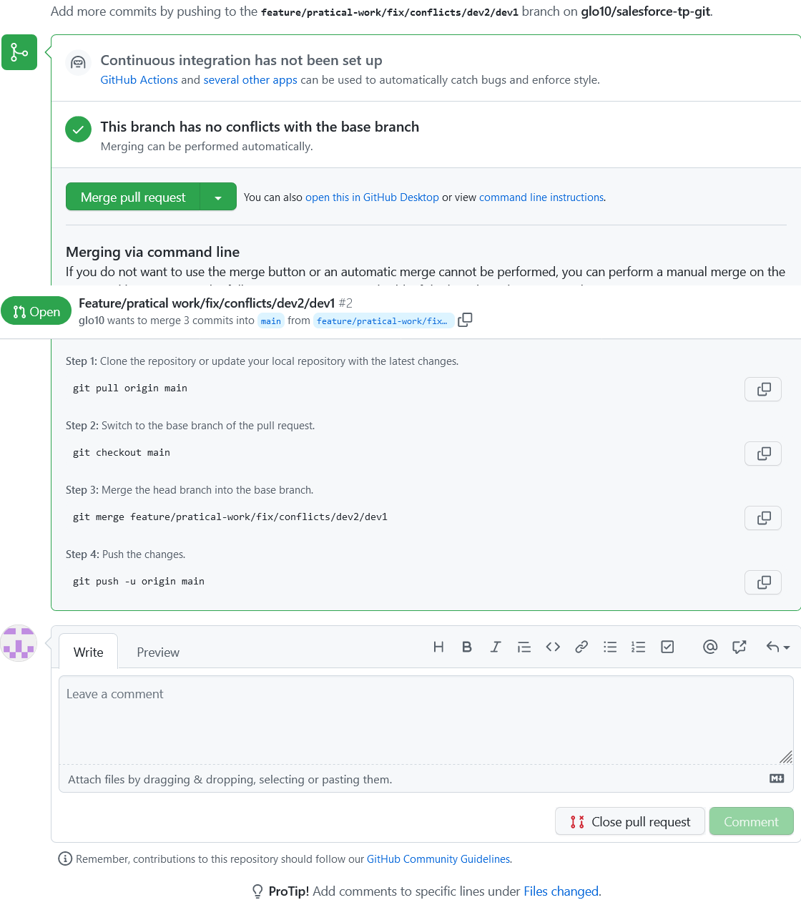
  
7. Depuis GitHub, après avoir effectué les *merge requests* des travaux des développeurs sur la branche *main*.

   1. Créez une *issue* nommée ***feature/prices*** et assignez-le à vous-même.
   2. Créez une nouvelle branche qui porte le même nom que l' *issue* depuis l'onglet ***Issues***, **attention** a bien renommer le nom de la branche pour avoir exactement le même nom que celle de l'*issue*.
##### Illustration création d'une branche à partir de l'onglet *Issues*

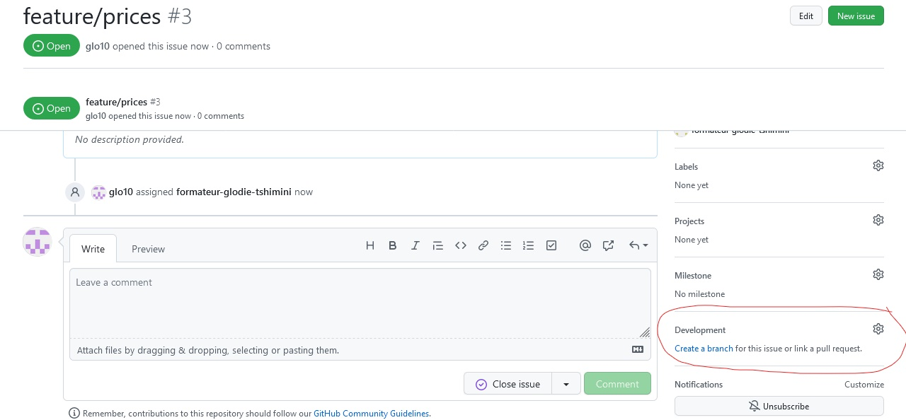
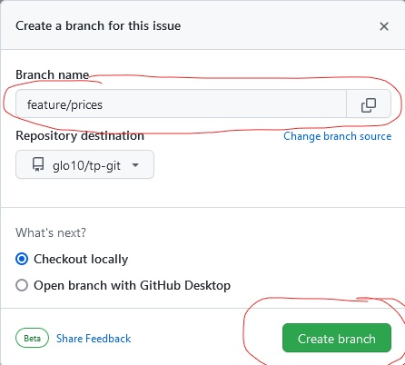

8. En local:

   1. Créez et récupérez la branche *feature/prices*.
   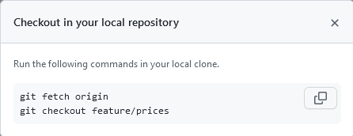
    ou à l'aide de la commande suivante : `git checkout -b feature/prices --track origin feature/prices` ;
   2. Ajoutez les prix aux produits présents sur chaque ligne des fichiers ***menu.md*** et ***drink.md*** ;
   4. Pushez vos modifications sur le dépôt distant ;
   5. Effectuez un *merge requests* de cette branche dans la branche *main* en assignant l'un des développeurs pour faire la revue de code ;
9. Prévenez vos collaborateurs de l'ajout des prix.

## Tâches du premier développeur au lancement du projet

1. Depuis votre boite de messagerie ou GitHub, acceptez l'invitation reçue.
2. Depuis GitHub, créez une nouvelle branche à partir de l'*issue* qui vous a été assignée, **attention** renommez le nom de la branche pour qu'elle soit identique au nom de l'*issue*.
Depuis l'onglet issue
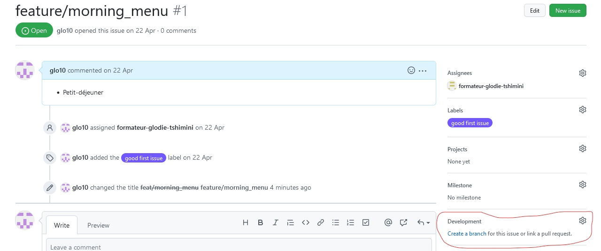
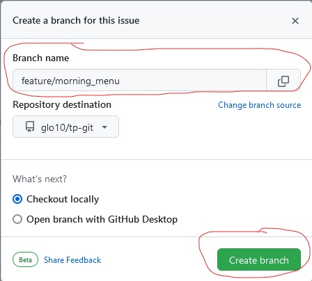
3. En local, créez une nouvelle branche portant le même que l' *issue* à l'aide de l'image suivante ou de la commande ci-après.
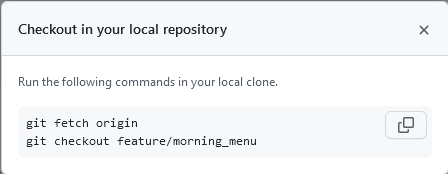
`git checkout -b feature/morning_menu --track origin feature/morning_menu`
4. **En local, à la racine du projet**

   1. Créez un fichier nommé ***`menu.md`*** qui doit lister vos viennoiseries préférées (une viennoiserie par ligne).
   2. Créez un fichier nommé ***`drink.md`*** contenant vos boissons favorites pour le petit-déjeuner (une boisson par ligne).
5. En local, commitez et pushez sur la branche *feature/morning_menu*.
6. Depuis GitHub, faites une demande de *pull request* :

   1. En mettant le développeur 2 en tant que ***Reviewers*** pour la revue du code;
   2. Assignez le *owner* dans ***Assignees***;
   3. Ajoutez un petit commentaire pour expliquer votre travail.
##### Illustration pour la demande de pull-request

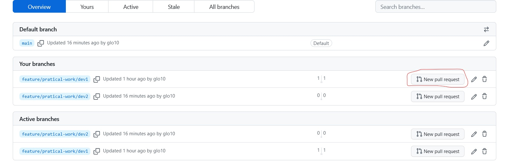

## Tâches du premier développeur après l'ajout des prix par le *owner*

7. En local, après avoir été notifié de l'ajout des prix par le *owner*.

   1. Récupérez toutes les modifications effectuées sur le dépôt distant.
   2. En cas de conflits, résolvez-les en communiquant avec vos collaborateurs.

## Tâches du second développeur au lancement du projet

1. Depuis votre boite de messagerie ou GitHub, acceptez l'invitation reçue.
2. Depuis GitHub, créez une nouvelle branche à partir de l'*issue* qui vous a été assignée, **attention** renommez le nom de la branche pour qu'elle soit identique au nom de l'*issue*.
Depuis l'onglet issue
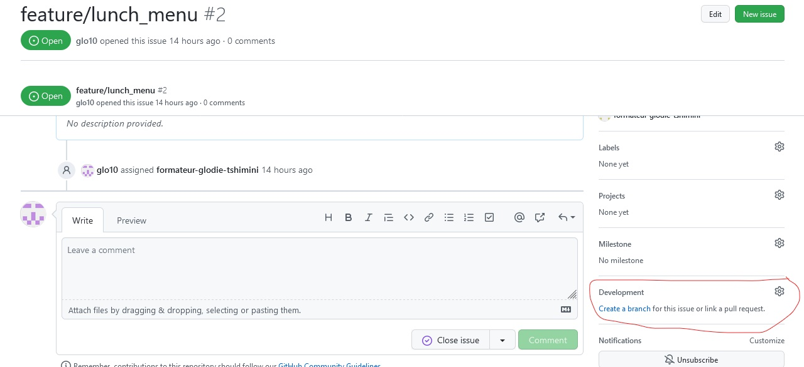
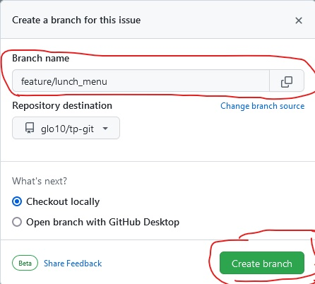
3. En local, créez une nouvelle branche portant le même que l' *issue* à l'aide de l'illustration ou de la commande ci-après.
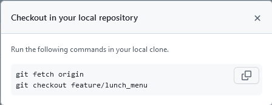
`git checkout -b feature/lunch_menu --track origin feature/lunch_menu`
4. **En local, à la racine du projet**

   1. Créez un fichier nommé ***`menu.md`*** listant vos plats préférés (un plat par ligne).
   2. Créez un fichier nommé ***`drink.md`*** contenant vos boissons favorites pour accompagner vos plats (une boisson par ligne).
5. En local, *commitez* et *pushez* sur la branche *feature/lunch_menu*.
6. Depuis GitHub, faites une demande de *pull request* :

   1. En mettant le développeur 1 en tant que ***Reviewers*** pour la revue du code;
   2. Assignez le *owner* dans ***Assignees***;
   3. Ajoutez un petit commentaire pour expliquer votre travail.
##### Illustration pour la demande de pull-request

### Tâches du sécond développeur après l'ajout des prix par le *owner*

7. En local, après avoir été notifié de l'ajout des prix par le *owner*.

   1. Récupérez toutes les modifications effectuées sur le dépôt distant.
   2. En cas de conflits, résolvez-les en communiquant avec vos collaborateurs.